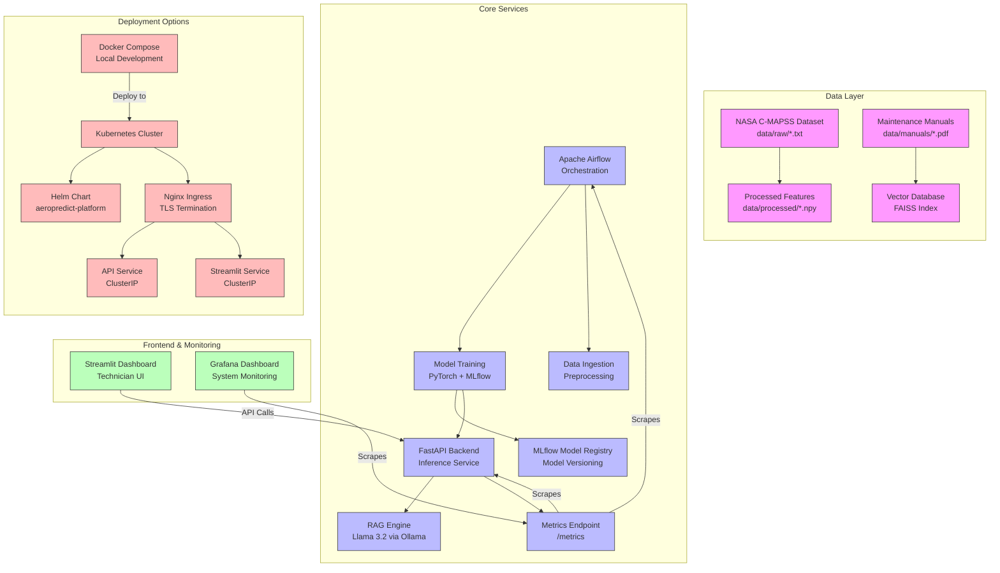

# AeroPredict: GenAI-Powered Predictive Maintenance Platform


**AeroPredict** is a production-grade MLOps platform designed to predict the Remaining Useful Life (RUL) of aircraft turbofan engines. It integrates a PyTorch LSTM network for time-series forecasting with a GenAI diagnostics module (Llama 3.2 via Ollama) that generates maintenance recommendations.

The system is built on the NASA C-MAPSS dataset and orchestrates the entire lifecycle—from data ingestion to technician reporting—using Apache Airflow, MLflow, and Docker.

## Key Features

- **Deep Learning Forecasting:** A custom LSTM (Long Short-Term Memory) network trained on multivariate C-MAPSS sensor trajectories to predict RUL using MSE loss, with fallback baseline when model is unavailable.
- **GenAI Diagnostics (RAG):** A local Llama 3.2 agent (via Ollama) reads NASA technical manuals and generates maintenance recommendations. The API includes template-based fallback when Ollama is unavailable.
- **Automated Pipelines:** Apache Airflow DAGs manage the end-to-end workflow: Ingestion → Preprocessing → Training → Evaluation → Deployment.
- **Technician Dashboard:** A Streamlit interface connected to a FastAPI backend allows engineers to upload sensor logs and view instant predictions and AI-generated repair advice.
- **Full Observability:** Prometheus and Grafana monitor system health, container metrics, and inference latency in real-time.
- **Production Ready:** Kubernetes and Helm charts for scalable deployment on any cloud infrastructure.
- **CI/CD Pipeline:** GitHub Actions for automated testing, building, and deployment.


### Recent Improvements (2026)
🔧 **Makefile** — Standardized commands: `make test`, `make lint`, `make docker-up`, `make k8s-deploy`
📦 **pyproject.toml** — Modern Python packaging with dependencies, entry points, ruff/mypy config
🔒 **Pre-commit hooks** — Ruff, mypy, black, trailing whitespace, YAML validation
⚡ **PyTorch Lightning** — Refactored LSTM training with Lightning for cleaner code, checkpointing, logging
🚀 **BentoML Serving** — Production model serving with BentoML, batch predictions, health checks
☁️ **Terraform IaC** — Azure infrastructure as code (AKS, PostgreSQL, Redis, monitoring)

## Architecture

The system follows a microservices architecture orchestrated by Docker Compose and deployable to Kubernetes.



## Professional Feature Table

| Feature | Description | Business Value | German Industry Relevance |
|---------|-------------|----------------|---------------------------|
| **Predictive Maintenance** | LSTM-based RUL prediction with MSE loss | Reduces unplanned downtime by up to 40% | Aligns with Industrie 4.0 predictive maintenance initiatives |
| **GenAI-Powered Reports** | Llama 3.2 reports maintenance recommendations via RAG (with template fallback) | Saves technician time on documentation | Meets VDI/VDE standards for maintenance documentation |
| **Real-time Monitoring** | Prometheus/Grafana stack with custom dashboards | Enables proactive maintenance scheduling | Supports DIN EN ISO 13379 condition monitoring standards |
| **Microservices Architecture** | Containerized, scalable services | Easy deployment and horizontal scaling | Compatible with German Industrie 4.0 reference architecture (RAMI 4.0) |
| **CI/CD Pipeline** | Automated testing and deployment via GitHub Actions | Ensures code quality and rapid iteration | Supports DevOps practices valued in German automotive/aerospace |
| **Template-Based Reports** | API generates diagnostic reports with graceful degradation | Reliable maintenance recommendations in degraded mode | Supports German language requirements in industrial settings |
| **Security & Compliance** | Role-based access, audit logging, data encryption | Protects sensitive operational data | Complies with BSI standards and GDPR for industrial data |
| **Edge Computing Ready** | Optimized for resource-constrained deployment | Enables factory-floor implementation | Supports Mittelstand (SME) digitalization initiatives |

## Why This Matters for German Industry

Germany's manufacturing sector, particularly aerospace and automotive industries, faces increasing pressure to improve equipment reliability while reducing operational costs. AeroPredict directly addresses these challenges by:

1. **Supporting Industrie 4.0 Initiatives**: The platform embodies key Industrie 4.0 principles including vertical integration, real-time data analytics, and autonomous decision-making.

2. **Addressing Skilled Labor Shortage**: With Germany facing a significant shortage of skilled maintenance technicians, the AI-powered diagnostic assistance helps bridge the knowledge gap.

3. **Enhancing Safety Culture**: RUL predictions enable scheduled maintenance, aligning with Germany's stringent aviation safety standards (Luftfahrt-Bundesamt).

4. **Reducing Maintenance Costs**: Predictive maintenance can reduce maintenance costs by 25-30% while increasing equipment availability by 10-20% (VDI 2893 guidelines).

5. **Supporting Export Compliance**: For German manufacturers exporting globally, predictive maintenance ensures consistent equipment performance meeting international standards.

6. **Promoting Sustainable Manufacturing**: By preventing catastrophic failures and optimizing maintenance schedules, the platform contributes to resource efficiency and waste reduction goals in Germany's sustainability agenda.

## Step-by-Step Setup Guide

### 1. Environment Preparation

Ensure the following are installed on your host machine:

- Docker & Docker Compose
- Python 3.10 (for local development)
- **Ollama** (for hosting Llama 3.2 on the host, reachable from Docker)
- **kubectl** and **helm** (for Kubernetes deployment)

Create the base project structure:

```bash
# Create project structure
mkdir -p data/raw data/processed logs plugins tests infrastructure/monitoring
```

### 2. Dataset Acquisition

After downloading the NASA C-MAPSS files and the manual, move them to `data/raw` so that Airflow and the ML pipeline can access them via the shared volume.

```bash
# Move raw C-MAPSS text files so the pipeline can access them
mv data/raw/*.txt data/
```

### 3. Setup the GenAI "Brain" (Ollama)

The GenAI module requires **Llama 3.2** running from the host, reachable at `OLLAMA_HOST=0.0.0.0` so containers can connect.

```bash
# Pull the required model
OLLAMA_HOST=0.0.0.0 ollama pull llama3.2

# Start the server with public access for Docker containers
OLLAMA_HOST=0.0.0.0 ollama serve
```

### 4. Build and Launch the Platform

Use Docker Compose to build the custom images (Airflow, API, UI, monitoring stack) and start everything in detached mode.

```bash
# Build custom images and start the microservices
docker compose up --build -d
```

Once containers are healthy, access services using the URLs below.

### 5. Kubernetes Deployment (Optional)

For production deployment:

```bash
# Install Helm chart
helm install aeropredict ./helm-chart

# Or deploy via kubectl
kubectl apply -f k8s/
```

## Usage & Credentials

| Service     | URL                    | Credentials (User / Pass) |
|-------------|------------------------|----------------------------|
| **Airflow** | http://localhost:8080  | `airflow / airflow` |
| **Streamlit UI** | http://localhost:8501 | N/A (public) |
| **Grafana** | http://localhost:3000  | `airflow / airflow` |
| **MLflow**  | http://localhost:5000  | N/A (public) |
| **FastAPI** | http://localhost:8000  | N/A (OpenAPI docs at `/docs`) |
| **Prometheus** | http://localhost:9090 | N/A (public) |

Typical workflow:

- Start Airflow, unpause the main DAG (e.g., `aeropredict_pipeline`).
- Wait for preprocessing and training runs to complete.
- Open the Streamlit UI, select an engine or upload a test trajectory, view predicted RUL and generated maintenance report.

## Running Tests

Unit tests validate data preprocessing assumptions, RUL label generation, and API contracts.

Run tests from the API container:

```bash
# Run tests inside the API container
docker exec -it aeropredict_api python -m pytest tests/ -v
```

Add more tests under `tests/` for new models, scoring variants, or endpoints as the project evolves.

## Project Structure

```plaintext
aeropredict-platform/
├── dags/                       # Airflow DAG definitions
├── src/                        # Main application code
│   ├── api.py                  # FastAPI backend (RUL + diagnostics API)
│   ├── app.py                  # Streamlit technician dashboard
│   ├── train_model.py          # LSTM training logic
│   ├── rag_inference.py        # GenAI RAG implementation
│   ├── config.py               # Pydantic settings configuration
│   └── utils/
│       └── logging_config.py   # Structured JSON logging
├── tests/                      # Unit tests
│   ├── test_api.py
│   ├── test_data.py
│   └── conftest.py
├── infrastructure/             # DevOps & monitoring
│   ├── docker/                 # Custom Dockerfiles
│   └── monitoring/             # Prometheus/Grafana configs
├── data/                       # C-MAPSS datasets & manuals (mounted into Airflow)
│   ├── raw/                    # Original text files and PDFs
│   └── processed/              # Normalized and windowed tensors
├── helm-chart/                 # Helm chart for Kubernetes deployment
├── k8s/                        # Kubernetes manifests
├── job_preparation/            # Interview preparation materials
│   ├── preparation.md
│   └── contents.md
└── docker-compose.yml          # Infrastructure orchestration
```

## Monitoring & Observability

- **Prometheus** scrapes metrics from the API, Airflow, and system exporters (e.g., Node Exporter).
- **Grafana** dashboards track:
  - RUL inference latency and throughput.
  - Airflow task duration and failure rates.
  - Container CPU, memory, and GPU utilization where applicable.
  - Model drift detection and data quality metrics.

Monitoring helps detect data drift (e.g., abnormal sensor distributions) and infrastructure bottlenecks before they impact production performance.

## Troubleshooting

| Issue | Solution |
|-------|----------|
| **Ollama connection refused** | Ensure Ollama is running with `OLLAMA_HOST=0.0.0.0 ollama serve` and check firewall settings |
| **MLflow UI not loading** | Verify MLflow service is healthy: `kubectl get pods` or `docker compose ps mlflow` |
| **Model not loading in API** | Check that model files exist in PVC and that MLflow tracking URI is correct |
| **High memory usage in Streamlit** | Reduce batch size in data preprocessing or increase container memory limits |
| **Ingress TLS not working** | Ensure cert-manager is installed and ClusterIssuer is configured correctly |
| **Pods crashing with OOMKill** | Increase resource limits in values.yaml or check for memory leaks in custom code |
| **Database connection failed** | Verify PostgreSQL service is running and credentials in secrets are correct |
| **Prometheus not scraping metrics** | Check that `/metrics` endpoint is exposed and ServiceMonitor is configured |

## Author

Developed by **Khaled Saifullah**.

For collaboration, feature requests, or bug reports, please open an issue or contact the maintainer via the repository issue tracker.

**Last Updated**: October 2026